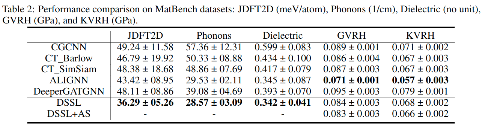
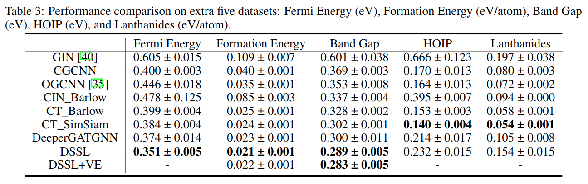

# DSSL
Code repository for our paper: Physics-guided Dual Self-supervised Learning for Materials Property Prediction

[Machine Learning and Evolution Laboratory](http://mleg.cse.sc.edu/),<br>
Department of Computer Science and Engineering <br>
University of South Carolina

[framework](./figures/framework.pdf)

Within DSSL, we employ DeeperGATGNN as the backbone. The pretraining stage trains DeeperGATGNN on an unlabeled database using self-supervised learning methods, and the subsequent finetuning follows the training of the original DeeperGATGNN on various labeled datasets but DeeperGATGNN part with shared weights from the pretraining stage.
## Table of Contents
- [Installations](#Installations)

- [Datasets](#Datasets)

- [Usage](#Usage)

- [Performance](#Performance)

- [Acknowledgement](#Acknowledgement)

- [Cite our work](#Cite our work)

## Installations

0. Set up a virtual environment using the following commands.
```
conda create -n dssl
conda activate dssl
```

1. **PyTorch**
Our code is tested on Pytorch 1.8.1 with cuda 11.1. Use the following command to install (or you can also install the other version using the command from the PyTorch website):
```
pip install torch==1.8.1+cu111 torchvision==0.9.1+cu111 torchaudio==0.8.1 -f https://download.pytorch.org/whl/torch_stable.html
```
 
2. **Pytorch Geometric**
Replace the `${TORCH}` and `${CUDA}` with your corresponding pytorch and cuda version. For example, if your PyTorch version is 1.8.1 and your CUDA version is 11.1, then replace `${TORCH}` with `1.8.1` and `${CUDA}` with cu111.
```
pip install torch-scatter -f https://pytorch-geometric.com/whl/torch-${TORCH}+${CUDA}.html
pip install torch-sparse -f https://pytorch-geometric.com/whl/torch-${TORCH}+${CUDA}.html
pip install torch-cluster -f https://pytorch-geometric.com/whl/torch-${TORCH}+${CUDA}.html
pip install torch-spline-conv -f https://pytorch-geometric.com/whl/torch-${TORCH}+${CUDA}.html
pip install torch-geometric
```

3. Other packages
```
pip install -r requirements.txt
```  

## Datasets  
| Datasets  | Description | Property | Sample No.|
| :---: | :---: | :---: | :---: | 
|  [MP](https://next-gen.materialsproject.org/)  | Pretraining  | - | 138, 614|
|  HOIP  | finetuning  | Band Gap (eV) | 1,345|
|  Lanthanides  | finetuning  | Formation Energ (eV/atom) | 4,166 | 
|  Fermi Energy  | finetuning  | Fermi Energy (eV) | 26,447 |
|  Formation Energy  | finetuning  | Formation Energy (eV/atom) | 26,741 |
|  Band Gap  | finetuning  | Band Gap (eV) | 27,110 |
|  [JDFT2D](https://matbench.materialsproject.org/Benchmark%20Info/matbench_v0.1/)  | finetuning  | Exfoliation Energy (meV/atom) | 636 |
|  [Phonons](https://matbench.materialsproject.org/Benchmark%20Info/matbench_v0.1/)  | finetuning  | Last Phdos Peak (1/cm) | 1,265 |
|  [Dielectric](https://matbench.materialsproject.org/Benchmark%20Info/matbench_v0.1/)  | finetuning  | Refractive Index (no unit) | 4,764 |
|  [GVRH](https://matbench.materialsproject.org/Benchmark%20Info/matbench_v0.1/)  | finetuning  | Shear Modulus (GPa)  | 10,987 |
|  [KVRH](https://matbench.materialsproject.org/Benchmark%20Info/matbench_v0.1/)  | finetuning  | Bulk Modulus (GPa) | 10,987|

## Usage
### Pretraining
* Run the following command for DSSL pretraining.
```
python main.py --data_path='$YOUR DATA PATH$'  --run_mode='Training'  --dropout_rate='0.3'
``` 
* Run the following command for DSSL + Micro pretraining
```
python main.py --data_path='$YOUR DATA PATH$'  --run_mode='Training' --microp='$AS or VE$'  --dropout_rate='0.3'
```
### Finetuning
* Run the following command for multiple repeated finetune
```
python main.py --data_path='$YOUR DATA PATH$'   --run_mode='Finetune'  --input_model_file='$YOUR PRETRAINED MODEL$' 
```
* Run the following command for cross-validation finetune
```
python main.py --data_path='$YOUR DATA PATH$'   --run_mode='CV'  --input_model_file='$YOUR PRETRAINED MODEL$' 
```  
  
### Predict
* Run the following command for property predictions of new material datasets.
```
python main.py --data_path='$YOUR DATA PATH$'   --run_mode='Predict'  
```
### Examples
Extract the contents of 'test_data.zip' into the `datasets` folder. Note that this toy data is intended only for testing the functionality of your code and should not be utilized for model training purposes.
* DSSL pretraining.
```
python main.py --data_path='./datasets/test_data/train'  --run_mode='Training'  --dropout_rate='0.3'
``` 
* DSSL + Micro pretraining
```
python main.py --data_path='./datasets/test_data/train'  --run_mode='Training' --microp='AS'  --dropout_rate='0.3'
python main.py --data_path='./datasets/test_data/train'  --run_mode='Training' --microp='VE'  --dropout_rate='0.3'
```
* Multiple repeated finetune
```
python main.py --data_path='./datasets/test_data/'   --run_mode='Finetune'  --input_model_file='my_model.pth' 
```
* Cross-validation finetune
```
python main.py --data_path='./datasets/test_data/train'   --run_mode='CV'  --input_model_file='my_model.pth' 
```
* Predict
```
python main.py --data_path='./datasets/test_data/test'   --run_mode='Predict'  
```

## Performance



## Acknowledgement
We use DeeperGATGNN as the backbone.
```
@article{omee2022scalable,
  title={Scalable deeper graph neural networks for high-performance materials property prediction},
  author={Omee, Sadman Sadeed and Louis, Steph-Yves and Fu, Nihang and Wei, Lai and Dey, Sourin and Dong, Rongzhi and Li, Qinyang and Hu, Jianjun},
  journal={Patterns},
  publisher={Elsevier}
}
```

## Cite our work


# Contact
If you have any problem using BERTOS, feel free to contact me via [funihang@gmail.com](mailto:funihang@gmail.com).

